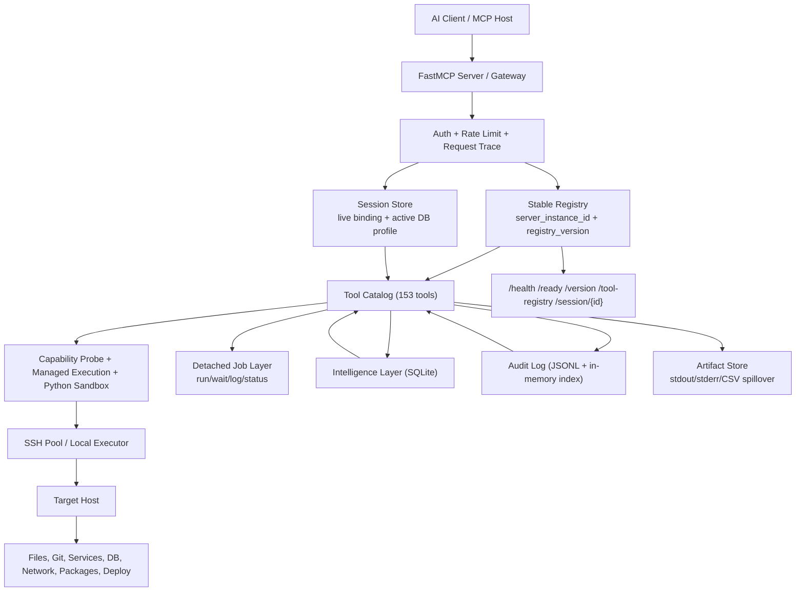

<p align="center">
  <br/>
  
  <br/>
  <h1 align="center">MCP Nexus</h1>
  <p align="center">
    <strong>Turn any AI assistant into a full-stack DevOps engineer for your server.</strong>
    <br/>
    153 tools for files, terminal, git, services, databases, debugging, monitoring, deployment, and observability<br/>
    — with a built-in intelligence layer that learns how you work.
  </p>
  <p align="center">
    <a href="#hosted-gateway">Hosted Gateway</a> &bull;
    <a href="#quick-start">Quick Start</a> &bull;
    <a href="#intelligence">Intelligence</a> &bull;
    <a href="#tools">153 Tools</a> &bull;
    <a href="#architecture">Architecture</a> &bull;
    <a href="#configuration">Config</a>
  </p>
  <p align="center">
    
    
    
    
  </p>
</p>

---

## Hosted Gateway

**Don't want to install anything?** Use the Lightcap-hosted MCP Nexus instance as a gateway to your servers:

```
https://lightcap.ai/mcp/nexus
```

Connect your AI client directly, enter your own server credentials once, and let ChatGPT or Claude operate that machine through the gateway. No agent install, no daemon on your server, no custom packaging step.

Why people use the hosted gateway:

- Bring any Linux server you already own. MCP Nexus handles the AI-facing side.
- Use one connection for terminal, files, git, deploy, database, process control, monitoring, and debugging.
- Keep the target explicit. You type your own server host, SSH user, SSH port, and SSH password at connect time.
- Skip setup overhead when you just want to put ChatGPT on a real machine and start shipping.

**Claude Desktop** (`claude_desktop_config.json`):

```json
{
  "mcpServers": {
    "nexus": {
      "url": "https://lightcap.ai/mcp/nexus/sse",
      "headers": {
        "Authorization": "Bearer YOUR_TOKEN"
      }
    }
  }
}
```

**Claude Code** (`.mcp.json`):

```json
{
  "mcpServers": {
    "nexus": {
      "url": "https://lightcap.ai/mcp/nexus/sse"
    }
  }
}
```

**ChatGPT Apps / Connectors**

Use the MCP server URL directly:

- **Connector URL:** `https://lightcap.ai/mcp/nexus`

ChatGPT discovers OAuth automatically from:

- `https://lightcap.ai/.well-known/oauth-authorization-server`
- `https://lightcap.ai/.well-known/oauth-protected-resource/mcp/nexus`

During `Connect`, MCP Nexus redirects you to a consent screen where you choose the SSH target for that ChatGPT connection. The resulting OAuth access token is then bound to that server and every tool call is routed through the matching SSH pool.

### ChatGPT Connect In 60 Seconds

What you will enter on the MCP Nexus consent page:

- Your server host or IP
- Your SSH user
- Your SSH port
- Your SSH password

Those are your real server credentials. They do not go into OAuth `client_id` or `client_secret`.

If the ChatGPT UI asks for manual OAuth fields instead of using discovery, use:

- **MCP URL:** `https://lightcap.ai/mcp/nexus`
- **Auth URL:** `https://lightcap.ai/authorize`
- **Token URL:** `https://lightcap.ai/token`
- **Client ID:** `nexus-lightcap-prod`
- **Client Secret:** `nxs_sec_9f78f08ec360-lc2026`
- **Scope:** `nexus` or leave it blank if the client allows that

These are the shared manual OAuth values for the Lightcap-hosted gateway only. They are not your server credentials and they are not meant for self-hosted MCP Nexus deployments.

Do not use these values in ChatGPT Connect:

- `https://lightcap.ai/mcp/nexus/oauth/token` as Auth URL
- `https://lightcap.ai/mcp/nexus/oauth/token` as Token URL
- Your server IP as OAuth `client_id`
- Your SSH password as OAuth `client_secret`

> **Important:** ChatGPT Connect uses standard OAuth discovery plus the consent screen. SSH host, user, port, password, or key belong in the consent step, not in OAuth client fields.

If you self-host MCP Nexus and want manual OAuth fields to work, configure a real static OAuth client in the server first:

- `NEXUS_OAUTH_CLIENT_ID`
- `NEXUS_OAUTH_CLIENT_SECRET`
- `NEXUS_OAUTH_CLIENT_REDIRECT_URIS`

`NEXUS_OAUTH_CLIENT_REDIRECT_URIS` must contain the exact ChatGPT callback URL shown by the client.

If you previously saved a connector with old manual values such as:

- Auth URL: `https://lightcap.ai/mcp/nexus/oauth/token`
- Token URL: `https://lightcap.ai/mcp/nexus/oauth/token`
- `client_id` = your server IP
- `client_secret` = your SSH password

delete that connector and create a fresh one. ChatGPT may keep reusing the stale OAuth client configuration, which produces invalid `/authorize` requests instead of the standards-based discovery flow.

If ChatGPT says `Client ID '...' not found`, the problem is not localhost handling and not your SSH target. It means the OAuth `client_id` in the connector does not match a configured MCP Nexus OAuth client.

### Legacy machine-to-machine token flow

For scripts, curl tests, or non-ChatGPT clients, the legacy gateway token endpoint still exists. This is a separate flow and should not be used as the ChatGPT Connect configuration:

```bash
curl -X POST https://lightcap.ai/oauth/token \
  -H "Content-Type: application/json" \
  -d '{
    "grant_type": "client_credentials",
    "client_id": "YOUR_SERVER_IP",
    "client_secret": "YOUR_SSH_PASSWORD"
  }'
```

The gateway validates by connecting to your server via SSH. Once authenticated, all 153 MCP tools operate on YOUR server through the Lightcap gateway. Full audit logging, rate limiting, and connection pooling included.

```
Your AI ──MCP/HTTPS──> lightcap.ai/mcp/nexus ──SSH──> Your Server
                            (gateway)                   (target)
```

> **Self-hosted?** Skip the gateway and run MCP Nexus on your own machine — see [Quick Start](#quick-start) below.

---

## Why MCP Nexus?

Most MCP servers give you tools. Nexus gives you tools **that remember**.

Every command you run, every service you restart, every file you edit — Nexus quietly learns your patterns. The next time you connect, it already knows what you were working on, which paths you use most, and what you'll probably need next.

```
You (via Claude/GPT) ──MCP──> MCP Nexus ──SSH──> Your Server
                                  │                   ├── Files (read, write, edit, search, diff)
                                  │                   ├── Terminal (execute commands, scripts)
                                  │                   ├── Git (commit, push, pull, branch)
                                  │                   ├── Services (systemd, docker, nginx)
                                  │                   ├── Database (PostgreSQL queries)
                                  │                   ├── Debug (lint, typecheck, syntax, TODOs)
                                  │                   ├── Monitoring (health, metrics, logs)
                                  │                   ├── Deploy (sync, restart, rollback)
                                  │                   ├── Network (ports, DNS, SSL, forwarding)
                                  │                   └── Packages (pip, apt, npm)
                                  │
                              Intelligence
                            ├── Session memory
                            ├── Preference learning
                            ├── Workflow detection
                            └── Smart suggestions
```

### What makes it different

| | Other MCP servers | MCP Nexus |
|---|---|---|
| **Hosted gateway** | Install-only | Use `lightcap.ai/mcp/nexus` instantly — zero setup |
| **Memory** | Stateless — every session starts from zero | Remembers your sessions, preferences, and workflows |
| **Scope** | Single-purpose (just files, just git) | 153 tools covering the full DevOps stack |
| **Debugging** | None | Lint, typecheck, syntax check, error search, symbol finder |
| **Connection** | Spawns new processes per call | Pooled SSH connections with auto-reconnect |
| **Recovery** | You notice when things break | Watchdog auto-restarts crashed services |
| **Auth** | None or basic | OAuth2 with scoped tokens and rate limiting |
| **Audit** | None | Every tool call logged with timing |

---

## Quick Start

### Install

```bash
pip install mcp-nexus
```

Or from source:

```bash
git clone https://github.com/lightcap-ai/mcp-nexus.git
cd mcp-nexus
pip install -e .
```

### Configure

```bash
cp .env.example .env
# Edit with your server credentials
```

Minimal `.env`:

```env
NEXUS_SSH_HOST=your-server-ip
NEXUS_SSH_KEY_PATH=~/.ssh/id_rsa
```

> **Note:** `NEXUS_SSH_USER` defaults to `root`. If your host uses a different account, set it explicitly in `.env`. Any non-root user should have the permissions your tool set requires for service, package, and deployment operations.

### Connect to your AI

**Claude Desktop** (`~/Library/Application Support/Claude/claude_desktop_config.json`):

```json
{
  "mcpServers": {
    "nexus": {
      "command": "mcp-nexus",
      "args": ["serve", "--transport", "stdio"]
    }
  }
}
```

**Claude Code** (`.mcp.json`):

```json
{
  "mcpServers": {
    "nexus": {
      "command": "mcp-nexus",
      "args": ["serve", "--transport", "stdio"]
    }
  }
}
```

**Remote / HTTP mode** (for web apps, shared teams):

```bash
mcp-nexus serve                # starts on port 8766
# Then connect via: http://your-host:8766/mcp
```

**Docker:**

```bash
docker compose up -d
```

---

## Intelligence

The intelligence layer is what turns Nexus from a tool shelf into an operating context. It stores interaction history in SQLite (`~/.mcp-nexus/memory.db` by default), keeps a JSONL audit trail, and exposes both layers back through MCP tools.

### What it learns

- **Session context**: recent actions, errors, and the last active workflow.
- **Preferences**: repeated repo paths, working directories, services, sandboxes, and deployment roots.
- **Workflow patterns**: explicit tool-to-tool transitions such as `git_status -> git_diff -> git_commit`.
- **Operational hotspots**: slow tools, failure-heavy tools, and audit-derived bottlenecks.

### Intelligence & Observability Tools

| Tool | What it does |
|------|-------------|
| `nexus_recall` | Recovers the last active context, recent actions, and learned preferences |
| `nexus_insights` | Shows totals, focus areas, failure hotspots, slow tools, and workflow signals |
| `nexus_suggest` | Suggests likely next tools from observed sequences |
| `nexus_preferences` | Lists, sets, or clears learned preferences |
| `nexus_workflows` | Returns the strongest detected multi-step workflows |
| `nexus_tool_catalog` | Exposes the explicit tool catalog and category counts |
| `nexus_audit_recent` | Reads recent structured audit entries |
| `nexus_audit_summary` | Aggregates error rate, p95 duration, and hotspot tools |
| `nexus_audit_failures` | Filters recent failed tool calls |
| `nexus_slowest_tools` | Surfaces the slowest recent calls for optimization work |

### Capability-Aware Defaults

Nexus no longer assumes one distro or service stack. It probes the connected host and uses that capability model to choose sensible defaults for:

- package management (`apt`, `dnf`, `yum`, `apk`, `pacman`, `zypper`, `brew`)
- service control (`systemd`, `service`, `launchctl`)
- compose/runtime flows (`docker compose`, `docker-compose`, `podman compose`)
- Python execution and sandbox support

Disable intelligence with `NEXUS_INTELLIGENCE=false` if you prefer stateless mode.

### Registry & Diagnostics

Nexus now separates stable registry generation from live session binding:

- every process gets a `server_instance_id`
- every tool snapshot gets a `registry_version`
- every tool exposes a stable alias like `/mcp-nexus/db_query`
- runtime binding details are attached as `resolved_runtime_id` metadata

For debugging registry drift and session issues, the HTTP server exposes:

- `/health`
- `/ready`
- `/version`
- `/tool-registry`
- `/sessions`
- `/session/{id}`

The same metadata is also available through MCP resources:

- `nexus://tool-registry`
- `nexus://version`
- `nexus://session/{id}`

Execution-heavy tools such as `execute_command`, `execute_python`, and the database suite now return structured payloads with:

- `ok`, `error_code`, `error_stage`
- `stdout`, `stderr`, `stdout_preview`, `stderr_preview`
- `artifact_paths`
- `server_instance_id`, `registry_version`, `request_id`, `trace_id`, `session_id`
- `backend_kind`, `backend_instance`, `duration_ms`

### Detached Jobs

Long-running jobs no longer need ad-hoc `nohup`, repeated `sleep`, or manual `ps/tail/wc` polling.

- `run_background_command` launches a detached job with managed stdout/stderr capture
- `background_job_status` returns pid, cpu/memory snapshot, log sizes, and previews
- `background_job_wait` waits server-side instead of forcing the client to poll
- `background_job_logs` reads captured output directly
- `background_job_stop` terminates by job id
- `list_background_jobs` gives you a reusable inventory across sessions

The runner enables `PYTHONUNBUFFERED=1` by default and uses `stdbuf -oL -eL` when available, which fixes the common “process is busy but log file stays empty” failure mode for ML/data jobs and similar pipelines.

---

## Tools

MCP Nexus currently exposes **153 tools** across execution, infrastructure, deployment, intelligence, and audit layers.

### Filesystem (19 tools)

| Tools | Description |
|------|-------------|
| `read_file`, `head_file`, `tail_file`, `batch_read` | Structured file reads with offsets and log-friendly previews |
| `write_file`, `edit_file`, `replace_in_file` | Write, patch, and replace file contents |
| `list_directory`, `tree`, `search_files`, `search_content` | Explore directories and search content quickly |
| `file_info`, `file_exists`, `count_lines` | Inspect metadata and file characteristics |
| `move_file`, `delete_file`, `create_directory` | Perform filesystem mutations with safety guards |
| `chmod_file`, `chown_file` | Adjust permissions and ownership |

### Terminal & Runtime (9 tools)

| Tools | Description |
|------|-------------|
| `execute_command` | Managed shell execution with usage metrics and optional CPU/memory/file/process limits |
| `execute_script` | Multi-line script execution through any interpreter |
| `execute_python` | Direct Python execution with optional reusable virtualenv sandbox |
| `server_capabilities`, `environment_info`, `which_command` | Inspect runtime defaults, detected backends, and binary availability |
| `create_python_sandbox`, `list_python_sandboxes`, `remove_python_sandbox` | Lifecycle management for reusable Python sandboxes on the target host |

### Git (14 tools)

| Tools | Description |
|------|-------------|
| `git_status`, `git_diff`, `git_log`, `git_show` | Inspect worktree, history, and specific objects |
| `git_stage`, `git_commit` | Stage explicitly and create commits |
| `git_branch`, `git_fetch`, `git_pull`, `git_push` | Drive branch and remote sync workflows |
| `git_remotes`, `git_tags`, `git_stash`, `git_blame` | Inspect remotes/tags, stash changes, and trace authorship |

### Debug & Code Analysis (12 tools)

| Tools | Description |
|------|-------------|
| `lint_python`, `format_code`, `typecheck` | Lint, format, and type-check code with the best available tool |
| `syntax_check`, `python_trace`, `run_tests` | Validate syntax, inspect Python issues, and run detected test suites |
| `find_todos`, `find_errors`, `stack_traces` | Search source and logs for TODOs, failures, and stack traces |
| `code_symbols`, `find_references`, `compare_files` | Navigate symbols, references, and diffs |

### Process & Services (24 tools)

| Tools | Description |
|------|-------------|
| `list_services`, `service_status`, `view_logs` | Service inventory and status through the detected service manager |
| `restart_service`, `start_service`, `stop_service` | Lifecycle control for services |
| `enable_service`, `disable_service`, `service_dependencies` | Boot-time control and dependency inspection |
| `list_processes`, `process_tree`, `process_open_files`, `process_status`, `kill_process` | Process inspection, point-in-time resource state, and intervention |
| `run_background_command`, `background_job_status`, `background_job_logs` | Managed detached execution with built-in log capture and fast inspection |
| `background_job_wait`, `background_job_stop`, `list_background_jobs` | Server-side waiting, stop control, and reusable job inventory |
| `cron_list`, `cron_add` | Crontab management |
| `docker_compose_ps`, `docker_compose_logs` | Compose-level service and log inspection |

### Database (18 tools)

| Tools | Description |
|------|-------------|
| `db_profiles`, `db_use` | List named database profiles and bind the current MCP session to one without exposing secrets |
| `db_query`, `db_safe_query`, `db_execute` | Query with optional row limiting, enforce read-only transactions, or run unrestricted statements |
| `db_explain`, `db_query_explain` | Inspect execution plans with explicit EXPLAIN tooling |
| `db_tables`, `db_schema`, `db_indexes`, `db_sample` | Explore schema, index layout, and sample rows with safe identifier quoting |
| `db_profile`, `db_join_suggest` | Profile tables from PostgreSQL statistics and surface likely join candidates |
| `db_export_csv` | Write query output to a CSV artifact in one step |
| `db_size`, `db_connections`, `db_table_stats`, `db_extensions` | Operational database visibility and extension inventory |

### Monitoring (10 tools)

| Tools | Description |
|------|-------------|
| `server_health`, `server_resources`, `io_activity` | High-level resource and pressure snapshots |
| `disk_usage`, `memory_usage`, `cpu_usage` | Focused resource inspection |
| `network_stats`, `active_connections` | Interface and socket visibility |
| `nginx_status`, `docker_status` | Opinionated service-specific health views |

### Deployment (11 tools)

| Tools | Description |
|------|-------------|
| `deploy_sync`, `deploy_service`, `deploy_health_check` | Direct sync/restart/validation workflows |
| `deploy_release`, `deploy_activate_release`, `deploy_rollback_release` | Release-directory deployment with stable symlink activation and rollback |
| `deploy_compose` | Compose-aware deploy/update flow |
| `create_backup`, `list_backups`, `restore_backup` | Backup and restore utilities |
| `pip_install` | Fast Python package installs for deploy hooks or bootstrap steps |

### Network & Port Forwarding (14 tools)

| Tools | Description |
|------|-------------|
| `check_port`, `port_scan`, `listening_ports` | Port reachability and socket discovery |
| `dns_lookup`, `ssl_info`, `curl_test`, `trace_route`, `network_route` | Connectivity and routing diagnostics |
| `firewall_rules`, `iptables_forward` | Firewall and NAT inspection/control |
| `port_forward`, `ssh_tunnel`, `list_forwards`, `remove_forward` | Forwarding and tunnel lifecycle management |

### Package Management (12 tools)

| Tools | Description |
|------|-------------|
| `package_managers`, `package_search`, `package_info`, `package_outdated`, `package_install` | Capability-aware system package workflows |
| `apt_list`, `apt_install` | Debian-specific compatibility tools |
| `pip_list`, `pip_show`, `python_virtualenvs` | Python package and virtualenv inspection |
| `npm_list`, `npm_install` | Node package inspection and installation |

### Intelligence (6 tools)

| Tools | Description |
|------|-------------|
| `nexus_recall`, `nexus_insights`, `nexus_suggest` | Recover context, analytics, and next-step suggestions |
| `nexus_preferences`, `nexus_workflows`, `nexus_tool_catalog` | Manage learned preferences and inspect the catalog/workflow model |

### Logs & Audit (4 tools)

| Tools | Description |
|------|-------------|
| `nexus_audit_recent`, `nexus_audit_summary`, `nexus_audit_failures`, `nexus_slowest_tools` | Query structured audit history and operational hotspots |

---

## Architecture



### Layering

1. **Tool layer** stays thin and task-oriented.
2. **Registry layer** owns stable tool identity and runtime binding metadata.
3. **Runtime layer** owns capability detection, execution wrapping, resource reporting, and sandbox setup.
4. **Detached job layer** owns long-running background commands and their captured logs.
5. **Transport layer** owns SSH pooling and localhost fallback.
6. **Intelligence + audit layers** observe behavior without owning product logic.

### How it works

1. The AI issues an MCP tool call.
2. Nexus resolves the target host, the active session, and the current registry binding.
3. Capability probing chooses the right package/service/runtime backend for that host.
4. Execution-heavy tools return structured envelopes and spill large output into local artifacts.
5. Long-running jobs can move into the detached job layer with durable job ids and captured stdout/stderr.
6. Audit + intelligence persist what happened and expose it back through MCP and HTTP diagnostics.

### Localhost mode

When `NEXUS_SSH_HOST` is `127.0.0.1`, `localhost`, or another local interface, Nexus skips SSH entirely and executes locally. This makes CI, laptop workflows, and single-node deployments simpler without changing the tool surface.

---

## Configuration

All configuration is environment-driven. Host capability detection supplies the operational defaults; environment variables only override when you need explicit behavior.

### SSH

| Variable | Default | Description |
|----------|---------|-------------|
| `NEXUS_SSH_HOST` | `127.0.0.1` | Target server hostname or IP |
| `NEXUS_SSH_PORT` | `22` | SSH port |
| `NEXUS_SSH_USER` | `root` | SSH username |
| `NEXUS_SSH_PASSWORD` | | SSH password |
| `NEXUS_SSH_KEY_PATH` | | SSH private key path |
| `NEXUS_SSH_POOL_SIZE` | `4` | Max concurrent SSH connections |

### Server & Runtime

| Variable | Default | Description |
|----------|---------|-------------|
| `NEXUS_HOST` | `0.0.0.0` | Bind host |
| `NEXUS_PORT` | `8766` | Bind port |
| `NEXUS_MCP_PATH` | `/mcp` | MCP endpoint path |
| `NEXUS_MCP_PATH_ALIASES` | | Optional comma-separated legacy/compatibility MCP paths such as `/mcp` |
| `NEXUS_LOG_LEVEL` | `info` | Logging level |
| `NEXUS_DEFAULT_CWD` | | Default working directory for execution tools |
| `NEXUS_COMMAND_TIMEOUT` | `60` | Default command timeout |
| `NEXUS_OUTPUT_LIMIT_BYTES` | `50000` | Stdout truncation limit |
| `NEXUS_ERROR_LIMIT_BYTES` | `10000` | Stderr truncation limit |
| `NEXUS_OUTPUT_PREVIEW_BYTES` | `4000` | Inline stdout preview size before artifact spillover |
| `NEXUS_ERROR_PREVIEW_BYTES` | `2000` | Inline stderr preview size before artifact spillover |
| `NEXUS_ARTIFACT_ROOT` | `~/.mcp-nexus/artifacts` | Local artifact directory for oversized stdout/stderr/CSV exports |
| `NEXUS_TOOL_ALIAS_BASE` | `/mcp-nexus` | Stable HTTP-style alias prefix attached to every tool |
| `NEXUS_FORWARDED_HEADERS` | `forwarded,x-forwarded-for,x-forwarded-host,x-forwarded-port,x-forwarded-proto` | Forwarded headers copied into request/session metadata |

### Intelligence & Audit

| Variable | Default | Description |
|----------|---------|-------------|
| `NEXUS_INTELLIGENCE` | `true` | Enable/disable the intelligence layer |
| `NEXUS_DATA_DIR` | `~/.mcp-nexus` | Local data directory for SQLite memory |
| `NEXUS_AUDIT_LOG_FILE` | `~/.mcp-nexus/audit.jsonl` | Audit log path; leave empty to use the default under `NEXUS_DATA_DIR` |

### Target Host Paths

These paths are evaluated on the **connected target host**, not expanded on the MCP client side.

| Variable | Default | Description |
|----------|---------|-------------|
| `NEXUS_SANDBOX_ROOT` | `~/.mcp-nexus/sandboxes` | Root directory for reusable Python sandboxes |
| `NEXUS_JOB_ROOT` | `/var/tmp/mcp-nexus/jobs` | Root directory for detached background jobs and captured stdout/stderr |
| `NEXUS_RELEASE_ROOT` | `/opt/mcp-nexus/releases` | Release directory root for release-based deploys |
| `NEXUS_CURRENT_RELEASE_LINK` | `/opt/mcp-nexus/current` | Stable symlink used by activation/rollback tools |

### Security

| Variable | Default | Description |
|----------|---------|-------------|
| `NEXUS_PUBLIC_BASE_URL` | | Public HTTPS origin used by ChatGPT and OAuth discovery |
| `NEXUS_OAUTH_ENABLED` | `true` | Enable standards-based OAuth discovery, registration, and consent routes |
| `NEXUS_OAUTH_ISSUER` | `NEXUS_PUBLIC_BASE_URL` | OAuth authorization server issuer |
| `NEXUS_OAUTH_CLIENT_ID` | `nexus-default` | Optional static OAuth client ID for manual Auth URL / Token URL screens |
| `NEXUS_OAUTH_CLIENT_SECRET` | | Optional static OAuth client secret for manual OAuth screens |
| `NEXUS_OAUTH_CLIENT_REDIRECT_URIS` | | Comma-separated exact callback URLs allowed for the static OAuth client |
| `NEXUS_OAUTH_SCOPES` | `nexus` | Valid scopes exposed via OAuth metadata |
| `NEXUS_OAUTH_DEFAULT_SCOPES` | `nexus` | Scopes granted by default to registered clients |
| `NEXUS_OAUTH_TOKEN_TTL_SECONDS` | `3600` | Access token lifetime |
| `NEXUS_OAUTH_REFRESH_TTL_SECONDS` | `2592000` | Refresh token lifetime |
| `NEXUS_OAUTH_AUTHORIZATION_CODE_TTL_SECONDS` | `600` | Authorization code lifetime |
| `NEXUS_OAUTH_CONSENT_PATH` | `/oauth/consent` | Consent UI path used during ChatGPT Connect |
| `NEXUS_RATE_LIMIT_RPM` | `120` | Requests per minute |
| `NEXUS_RATE_LIMIT_BURST` | `20` | Burst capacity |

### Database (optional)

Use named profiles when you do not want agents to ever see raw credentials in tool arguments. Legacy `NEXUS_DB_*` variables still work and are mapped into the default profile for backward compatibility.

| Variable | Default | Description |
|----------|---------|-------------|
| `NEXUS_DB_PROFILES_JSON` | | JSON object of named PostgreSQL profiles consumed by `db_profiles` / `db_use` |
| `NEXUS_DB_DEFAULT_PROFILE` | `default` | Default profile when no session-bound profile is active |
| `NEXUS_DB_HOST` | | PostgreSQL host |
| `NEXUS_DB_PORT` | `5432` | PostgreSQL port |
| `NEXUS_DB_NAME` | | Database name |
| `NEXUS_DB_USER` | | Database user |
| `NEXUS_DB_PASSWORD` | | Database password |
| `NEXUS_DB_SSLMODE` | | Optional PostgreSQL SSL mode for the legacy/default profile |

### Watchdog

| Variable | Default | Description |
|----------|---------|-------------|
| `NEXUS_WATCHDOG_SERVICES` | | Comma-separated services to monitor |
| `NEXUS_WATCHDOG_INTERVAL` | `30` | Health check interval (seconds) |
| `NEXUS_MAX_RESTART_ATTEMPTS` | `10` | Max auto-restarts per cooldown window |
| `NEXUS_RESTART_COOLDOWN` | `120` | Cooldown window (seconds) |

---

## Deployment

### Docker

```bash
docker compose up -d
```

### Systemd

```bash
./scripts/deploy-to-server.sh your-server-ip root 22
```

Creates a systemd service with auto-restart + nginx reverse proxy snippet. If `.env` already contains `NEXUS_SSH_HOST`, `NEXUS_SSH_USER`, `NEXUS_SSH_PORT`, or `NEXUS_SSH_KEY_PATH`, the script will use them automatically when arguments are omitted.

The generated nginx snippet now includes `/mcp/nexus`, `/mcp`, `/health/nexus`, `/ready/nexus`, and `/version/nexus` so legacy clients and new diagnostics can coexist cleanly.

### Release-Based Deploys

The built-in deploy tools support a cleaner release flow than a one-off restart:

1. `deploy_release` syncs into `NEXUS_RELEASE_ROOT/<timestamp>`
2. `deploy_activate_release` updates `NEXUS_CURRENT_RELEASE_LINK`
3. `deploy_health_check` validates the new release
4. `deploy_rollback_release` flips the symlink back when needed

This keeps rollback state explicit and inspectable instead of burying it in ad-hoc shell scripts.

### Compose Deploys

Use `deploy_compose` when the target host has `docker compose`, `docker-compose`, or `podman compose` available. Nexus detects the backend and drives the correct command by capability rather than by a hardcoded distro assumption.

### Behind Nginx

```nginx
location /mcp/nexus {
    proxy_pass http://127.0.0.1:8766/mcp/nexus;
    proxy_http_version 1.1;
    proxy_set_header Host $host;
    proxy_set_header X-Real-IP $remote_addr;
    proxy_set_header X-Forwarded-For $proxy_add_x_forwarded_for;
    proxy_set_header X-Forwarded-Proto $scheme;
    proxy_set_header Connection "";
    proxy_buffering off;
    proxy_cache off;
    proxy_read_timeout 300s;
    proxy_send_timeout 300s;
}

location = /.well-known/oauth-authorization-server {
    proxy_pass http://127.0.0.1:8766/.well-known/oauth-authorization-server;
    proxy_http_version 1.1;
    proxy_set_header Host $host;
    proxy_set_header X-Real-IP $remote_addr;
    proxy_set_header X-Forwarded-For $proxy_add_x_forwarded_for;
    proxy_set_header X-Forwarded-Proto $scheme;
}

location /.well-known/oauth-protected-resource/ {
    proxy_pass http://127.0.0.1:8766/.well-known/oauth-protected-resource/;
    proxy_http_version 1.1;
    proxy_set_header Host $host;
    proxy_set_header X-Real-IP $remote_addr;
    proxy_set_header X-Forwarded-For $proxy_add_x_forwarded_for;
    proxy_set_header X-Forwarded-Proto $scheme;
}

location = /authorize {
    proxy_pass http://127.0.0.1:8766/authorize;
    proxy_http_version 1.1;
    proxy_set_header Host $host;
    proxy_set_header X-Real-IP $remote_addr;
    proxy_set_header X-Forwarded-For $proxy_add_x_forwarded_for;
    proxy_set_header X-Forwarded-Proto $scheme;
}

location = /token {
    proxy_pass http://127.0.0.1:8766/token;
    proxy_http_version 1.1;
    proxy_set_header Host $host;
    proxy_set_header X-Real-IP $remote_addr;
    proxy_set_header X-Forwarded-For $proxy_add_x_forwarded_for;
    proxy_set_header X-Forwarded-Proto $scheme;
}

location = /register {
    proxy_pass http://127.0.0.1:8766/register;
    proxy_http_version 1.1;
    proxy_set_header Host $host;
    proxy_set_header X-Real-IP $remote_addr;
    proxy_set_header X-Forwarded-For $proxy_add_x_forwarded_for;
    proxy_set_header X-Forwarded-Proto $scheme;
}

location = /oauth/consent {
    proxy_pass http://127.0.0.1:8766/oauth/consent;
    proxy_http_version 1.1;
    proxy_set_header Host $host;
    proxy_set_header X-Real-IP $remote_addr;
    proxy_set_header X-Forwarded-For $proxy_add_x_forwarded_for;
    proxy_set_header X-Forwarded-Proto $scheme;
}

location = /oauth/token {
    proxy_pass http://127.0.0.1:8766/oauth/token;
    proxy_http_version 1.1;
    proxy_set_header Host $host;
    proxy_set_header X-Real-IP $remote_addr;
    proxy_set_header X-Forwarded-For $proxy_add_x_forwarded_for;
    proxy_set_header X-Forwarded-Proto $scheme;
    proxy_set_header Connection "";
}
```

> **Important:** ChatGPT `Connect` depends on `/.well-known/oauth-authorization-server`, `/.well-known/oauth-protected-resource/...`, `/authorize`, `/token`, `/register`, and `/oauth/consent` being reachable on the same public origin as `/mcp/nexus`. If any of those paths fall through to the website frontend, `Connect` will fail before the first tool call.

---

## Authentication

For ChatGPT Apps and connectors, MCP Nexus now exposes a standards-based OAuth surface next to the MCP resource server:

- MCP resource server: `/mcp/nexus`
- Authorization server metadata: `/.well-known/oauth-authorization-server`
- Protected resource metadata: `/.well-known/oauth-protected-resource/mcp/nexus`
- Dynamic client registration: `/register`
- Authorization code + PKCE: `/authorize` and `/token`
- Consent UI: `/oauth/consent`

During `Connect`, the consent form binds the resulting OAuth token to an SSH target. Every MCP call carrying that token is then routed to the correct SSH pool.

### Which fields to use in ChatGPT

For ChatGPT Apps / Connectors, the preferred input is only:

- MCP URL: `https://lightcap.ai/mcp/nexus`

ChatGPT should discover the rest automatically from the well-known OAuth metadata.

If a manual OAuth form appears, use:

- Auth URL: `https://lightcap.ai/authorize`
- Token URL: `https://lightcap.ai/token`
- Client ID: `nexus-lightcap-prod`
- Client Secret: `nxs_sec_9f78f08ec360-lc2026`
- Scope: `nexus` or blank

Do not enter:

- `https://lightcap.ai/mcp/nexus/oauth/token` as Auth URL or Token URL
- Your server IP as `client_id`
- Your SSH password as `client_secret`

Those values belong to the legacy machine-to-machine flow below, not the ChatGPT connector flow.

If ChatGPT opens `/authorize` with a URL that does not include `code_challenge=...`, you are still using an old manual OAuth configuration. Remove that connector and add MCP Nexus again from the MCP URL only.

If ChatGPT returns `Client ID '...' not found`, that is an OAuth client registration problem, not an SSH host or localhost problem. It means the value in the ChatGPT OAuth form does not match a configured static OAuth client on the server.

For the Lightcap-hosted gateway, the standard shared manual client is:

- Client ID: `nexus-lightcap-prod`
- Client Secret: `nxs_sec_9f78f08ec360-lc2026`

You still enter your own server host, SSH user, SSH port, and SSH password on the consent page after OAuth succeeds.

### Legacy gateway token flow

The direct machine-to-machine endpoint remains available for scripts and manual testing:

```bash
curl -X POST https://lightcap.ai/oauth/token \
  -H "Content-Type: application/json" \
  -d '{
    "grant_type": "client_credentials",
    "client_id": "YOUR_SERVER_IP",
    "client_secret": "YOUR_SSH_PASSWORD",
    "ssh_user": "root",
    "ssh_port": 22
  }'
```

### Self-hosted mode

When running MCP Nexus privately on your own machine, disable public OAuth by omitting `NEXUS_PUBLIC_BASE_URL` or setting `NEXUS_OAUTH_ENABLED=false`.

---

## Development

```bash
git clone https://github.com/lightcap-ai/mcp-nexus.git
cd mcp-nexus
python -m venv .venv && source .venv/bin/activate
pip install -e ".[dev]"

pytest             # run tests
ruff check .       # lint
mypy mcp_nexus/    # type check
```

---

## License

MIT License - see [LICENSE](LICENSE) for details.

---

<p align="center">
  Built by <a href="https://lightcap.ai">Lightcap AI</a> &bull; Hosted at <a href="https://lightcap.ai/mcp/nexus">lightcap.ai/mcp/nexus</a>
</p>
